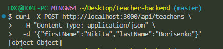
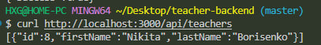
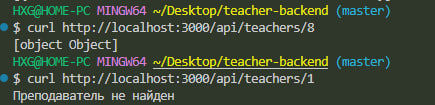
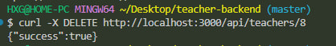

## Установка
bun install
## Запуск сервера 
bun run src/index.ts
## Настройте базу данных:

npx prisma migrate dev --name init

npx prisma generate

# 1. Добавление преподавателя (POST)
### запрос:
curl -X POST http://localhost:3000/api/teachers \
  -H "Content-Type: application/json" \
  -d '{"firstName":"Nikita","lastName":"Borisenko"}'

  

  ### ответ:
[object Object]

# 2 Получение всех преподавателей (GET)
### запрос: 
curl http://localhost:3000/api/teachers

### ответ:

[{"id":8,"firstName":"Nikita","lastName":"Borisenko"}]

# 3. Получение преподавателя по ID (GET)
### Запрос:
curl http://localhost:3000/api/teachers/8

### ответ: 

[object Object]

*Если пользователя не существует то ответ(Преподаватель не найден)*

# 4. Удаление преподавателя (DELETE)
### запрос: 
curl -X DELETE http://localhost:3000/api/teachers/8

### ответ:
{"success":true}

